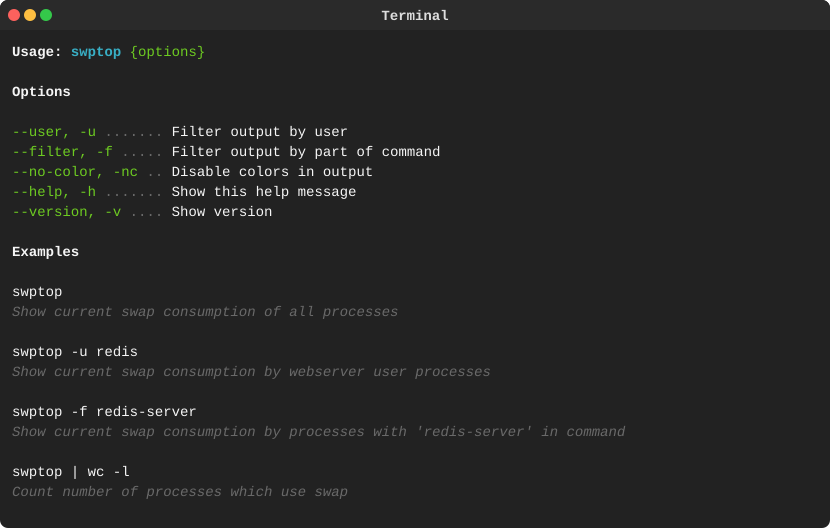

<p align="center"><a href="#readme"></a></p>

<p align="center">
  <a href="https://kaos.sh/r/swptop"></a>
  <a href="https://kaos.sh/y/swptop"></a>
  <a href="https://kaos.sh/w/swptop/ci"></a>
  <a href="https://kaos.sh/w/swptop/codeql"></a>
  <a href="#license"></a>
</p>

<p align="center"><a href="#installation">Installation</a> • <a href="#usage">Usage</a> • <a href="#ci-status">CI Status</a> • <a href="#contributing">Contributing</a> • <a href="#license">License</a></p>

<br/>

`swptop` is simple utility for viewing swap consumption of processes.

### Installation

#### From source

To build the `swptop` from scratch, make sure you have a working Go 1.25+ workspace ([instructions](https://go.dev/doc/install)), then:

```
go install github.com/essentialkaos/swptop@latest
```

#### From [ESSENTIAL KAOS Public Repository](https://kaos.sh/kaos-repo)

```bash
sudo dnf install -y https://pkgs.kaos.st/kaos-repo-latest.el$(grep 'CPE_NAME' /etc/os-release | tr -d '"' | cut -d':' -f5).noarch.rpm
sudo dnf install swptop
```

#### Prebuilt binaries

You can download prebuilt binaries for Linux from [EK Apps Repository](https://apps.kaos.st/swptop/latest).

To install the latest prebuilt version, do:

```bash
bash <(curl -fsSL https://apps.kaos.st/get) swptop
```

### Usage



### CI Status

| Branch | Status |
|--------|--------|
| `master` | [](https://kaos.sh/w/swptop/ci?query=branch:master) |
| `develop` | [](https://kaos.sh/w/swptop/ci?query=branch:develop) |

### Contributing

Before contributing to this project please read our [Contributing Guidelines](https://github.com/essentialkaos/.github/blob/master/CONTRIBUTING.md).

### License

[Apache License, Version 2.0](https://www.apache.org/licenses/LICENSE-2.0)

<p align="center"><a href="https://kaos.dev"></a></p>
